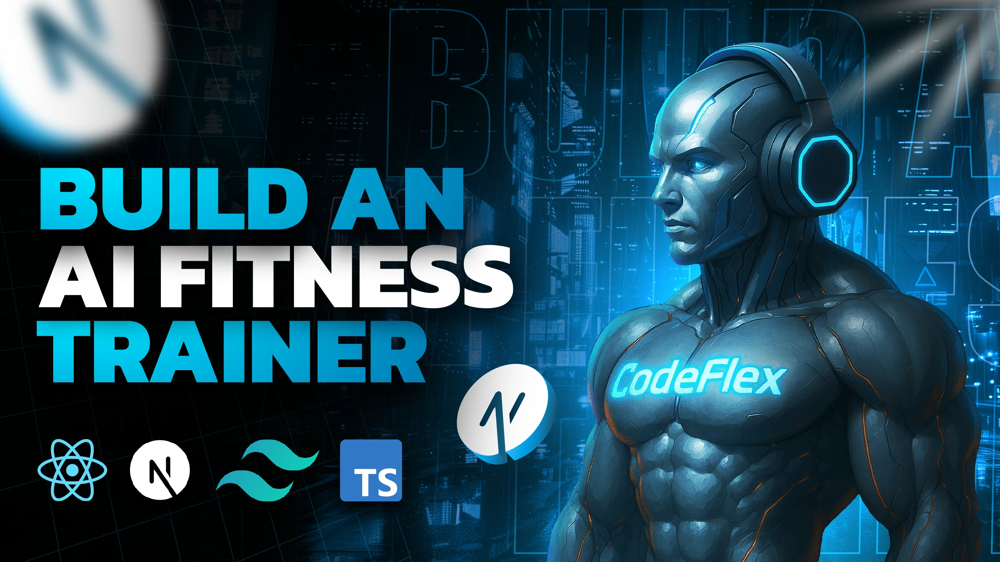

<h1 align="center">💪  FitFusion AI – Your Smart Fitness Companion 🤖</h1>



## Highlights:

- 🚀 Tech stack: Next.js, React, Tailwind & Shadcn UI
- 🎙️ Voice AI Assistant (Vapi)
- 🧠 LLM Integration (Gemini AI)
- 🏋️ Personalized Workout Plans
- 🥗 Custom Diet Programs
- 🔒 Authentication & Authorization (Clerk)
- 💾 Database (Convex)
- 🎬 Real-time Program Generation
- 💻 Layouts
- 🎭 Client & Server Components

## 🔥 Core Features

- **🎙️ Smart AI Assistant**: Engage in real-time conversations with a voice-enabled AI assistant that tailors its questions to your goals, fitness level, and dietary needs.

- **🏋️ Personalized Workout Plans**: Get custom routines based on your experience, physical condition, injuries, and fitness goals.

- **🥗 Custom Diet Recommendations**: Receive meal plans that respect your allergies, dietary preferences, and nutrition goals.

- **🔐 Authentication & Authorization**: Secure sign-in options via GitHub, Google, or email/password using Clerk.

- **📋 Program Management**: Create, view, and manage multiple fitness programs. Only the latest one remains active at a time.

- **🎬 Real-Time AI-Generated Programs**: Instantly receive AI-curated workout and diet plans based on real-time inputs.

- **🖥️ Modern UI & UX**: Responsive layouts built with Tailwind and Shadcn UI for a smooth experience across all devices.

## ⚙️ Setup .env file

```js
# Clerk Authentication
NEXT_PUBLIC_CLERK_PUBLISHABLE_KEY=
CLERK_SECRET_KEY=

# Clerk Redirect URLs
NEXT_PUBLIC_CLERK_SIGN_IN_URL=/sign-in
NEXT_PUBLIC_CLERK_SIGN_UP_URL=/sign-up

# Vapi Voice AI
NEXT_PUBLIC_VAPI_WORKFLOW_ID=
NEXT_PUBLIC_VAPI_API_KEY=

# Convex Database
CONVEX_DEPLOYMENT=
NEXT_PUBLIC_CONVEX_URL=
```

## Getting Started

1. Clone the repository
2. Install dependencies:

```shell
npm install
```

3. Set up your environment variables as shown above
4. Run the development server:

```shell
npm run dev
```

5. Open [http://localhost:3000](http://localhost:3000) in your browser

## Deployment

This application can be easily deployed to Vercel:

```shell
npm run build
npm run start
```

Or connect your GitHub repository to Vercel for automatic deployments.

## Technologies Used

- **Next.js**: React framework for building the frontend and API routes
- **Tailwind CSS & Shadcn UI**: For styling and UI components
- **Clerk**: Authentication and user management
- **Vapi**: Voice agent platform for conversational AI
- **Convex**: Real-time database
- **Gemini AI**: Large Language Model for generating personalized fitness programs

## Learn More

To learn more about the technologies used in this project:

- [Next.js Documentation](https://nextjs.org/docs)
- [Clerk Documentation](https://clerk.com/docs)
- [Vapi Documentation](https://docs.vapi.ai)
- [Convex Documentation](https://docs.convex.dev)
- [Gemini AI Documentation](https://ai.google.dev/gemini-api)

## 🤝 Contributing

Pull requests are welcome! If you'd like to contribute:

1. Fork the repository
2. Create your feature branch: `git checkout -b feature/YourFeature`
3. Commit your changes: `git commit -m "Add feature"`
4. Push to the branch: `git push origin feature/YourFeature`
5. Open a pull request

## 🧠 Credits

Built with 💡 by Alex Mieses using the latest in AI and web technologies and  conversational voice assistants.

## 📄 License

This project is licensed under the MIT License.
